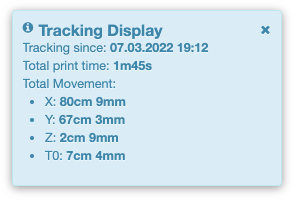

# OctoPrint-MaintenanceManager

OctoPrint-Plugin that tracks print-time (total & on parts), axis-movements and has the ability to create "Maintenance Reports".

It can also define "Maintenance Alerts", so that you never missed to tie up your belts ;-)

# WORKIN PROGRESS, NO FINAL RELEASE, yet!!!! Only a DEV-release

### Support my Efforts

This plugin, as well as my [other plugins](https://github.com/OllisGit/) were developed in my spare time.
If you like it, I would be thankful about a cup of coffee :)

## Tested with:
- OctoPrint 1.7.2:  with Python 3.7.3

## Features
- [x] Total XYZE linear movement (only G0, G1. No G2/G3 or G28 or other manuel movement via control box)
- [x] Total print time (pause excluded)
- [ ] Track runtime/movement for predefined hardware parts (e.g. "#1 Nozzel 0.4", Duration=1d12h, Extrusion=123m )
- [ ] Track fan runtime (M106/M107)
- [ ] Add "Maintenance Item" (e.g. "Changed X-Belt", X-Movement was at: 5k 165m 16cm)
- [ ] List/Filter/Search for "Maintenance Report"
- [ ] Add multiple images to a "Maintenance Report"
- [ ] CSV Export of "Maintenance Report(s)"
- [ ] Define "Maintenance Alerts" on "total print time", "part print time", "axis movement"

## Screenshots

## Setup

Install via the bundled [Plugin Manager](https://docs.octoprint.org/en/master/bundledplugins/pluginmanager.html)
or manually using this URL:

TAKE A LOOK INTO THE RELEASE-SECTION

    https://github.com/OllisGit/OctoPrint-MaintenanceManager/releases/latest/download/master.zip

## Versions

see [Release-Overview](https://github.com/OllisGit/OctoPrint-MaintenanceManager/releases/)

